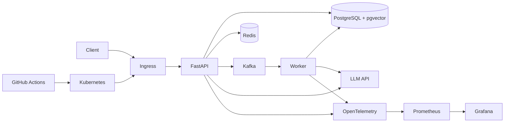

최근 이직 공고를 검토하면서 한 가지가 분명해졌다.

지금까지 Java/Spring과 Python/FastAPI 기반 백엔드 개발, SQL과 데이터 처리, Linux/Docker 기반 배포 환경, 인증/인가와 보안 요구사항, LLM/Agent 응용서비스 구현 경험을 쌓아왔다. 특히 Python/FastAPI는 약 3년간 여러 프로젝트에서 반복해서 사용했다.

반면 보상이 높은 AI Backend, Platform, Security Architecture 인접 포지션에서는 단순히 API를 개발할 수 있는지를 넘어서 다음 경험을 반복해서 요구한다.

- Kubernetes 기반 배포와 운영
- 대규모 Backend Architecture 설계
- Redis/Kafka 등을 활용한 비동기 처리와 장애 격리
- 서비스 관측성
- 장애 탐지와 복구
- 성능 테스트와 병목 개선
- AI 서비스의 timeout, retry, fallback, evaluation 같은 운영 안정성

자격증이나 기술 목록만 추가해서는 이 차이를 메우기 어렵다. 그래서 이번에는 새로운 기능을 많이 만드는 것보다, 하나의 백엔드 서비스를 실제 운영 가능한 형태까지 깊게 구현하고 그 과정을 공개 증거로 남기기로 했다.

## 현재 강점과 보완할 부분

현재 강점은 다음과 같이 정리할 수 있다.

| 영역 | 현재 경험 |
|---|---|
| Backend | Java/Spring, Python/FastAPI 기반 웹/API 개발 |
| Data | PostgreSQL, Oracle, Hive, SQL 기반 데이터 처리와 서비스 연계 |
| AI Application | LLM API, Text2SQL, Agent 응용, 문서/PDF 처리 |
| Security | 인증/인가, SSO, 역할 기반 접근통제, 보안/네트워크 선행경력 |
| Infra | Linux, Docker/Podman, Jenkins, GitHub Actions |

반면 공개적으로 증명할 수 있는 근거가 상대적으로 부족한 영역은 아래와 같다.

| 보완 영역 | 부족한 증거 |
|---|---|
| Kubernetes | 직접 배포, 롤링 업데이트, 장애 복구, 오브젝트 설계 증거 |
| Architecture | 캐시, 비동기 처리, 장애 격리, 확장 구조를 설계한 공개 사례 |
| Observability | metrics, logs, traces를 연결한 운영 사례 |
| Incident Response | 의도적으로 장애를 만들고 탐지, 복구, 재발 방지까지 수행한 기록 |
| Performance | 부하 테스트, 병목 분석, 개선 전후 결과 |
| AI Production | LLM 지연, 실패, retry, fallback, 비용/품질 지표를 운영 관점에서 다룬 증거 |

이 프로젝트의 목적은 이 표의 빈칸을 실제 코드와 검증 결과로 채우는 것이다.

## 프로젝트 방향

새 공개 저장소 이름은 다음처럼 잡으려고 한다.

```text
ai-backend-production-lab
```

의도적으로 `production`이 아니라 `production-lab`이라는 의미를 유지한다. 실제 고객 트래픽을 운영한 상용 서비스라고 과장하지 않고, 운영 환경에서 필요한 문제를 재현하고 검증하는 공개 실습 프로젝트라는 점을 분명히 하기 위해서다.

프로젝트 주제는 단순 CRUD보다 현재 경력과 연결되는 AI Backend가 적합하다.

예시는 다음과 같다.

```text
문서 업로드
-> 문서 처리 및 임베딩
-> PostgreSQL/pgvector 저장
-> 검색
-> LLM 응답
-> 결과와 처리 이력 저장
```

기능 자체는 최소화하고, 배포와 운영 품질에 더 많은 시간을 사용한다.

## 목표 아키텍처



초기 버전부터 모든 구성요소를 넣지는 않는다. 단계적으로 추가하면서 각 단계의 필요성과 효과를 측정한다.

## 단계별 구현 계획

### 1. 최소 서비스 구현

먼저 FastAPI와 PostgreSQL로 동작하는 가장 작은 서비스를 만든다.

목표:

- REST API
- PostgreSQL 데이터 저장
- pgvector 기반 검색
- 외부 LLM API 연동
- 구조화된 로그
- 기본 테스트

이 단계에서는 마이크로서비스로 쪼개지 않는다. 단일 서비스가 충분한 상태에서 불필요하게 복잡도를 늘리지 않는 것도 설계 판단의 일부로 남긴다.

### 2. 컨테이너와 자동 배포

다음으로 Docker 기반 실행 환경과 CI/CD를 구성한다.

검증할 내용:

- 재현 가능한 이미지 빌드
- 환경변수와 Secret 분리
- 테스트 실패 시 배포 차단
- 버전 태깅
- 이전 버전으로 rollback 가능한 구조

### 3. 관측성

Prometheus, Grafana, OpenTelemetry를 추가한다.

처음부터 너무 많은 지표를 만들기보다 다음 핵심 지표부터 시작한다.

- Request rate
- Error rate
- P95/P99 latency
- CPU/Memory
- DB connection 사용량
- LLM latency
- LLM failure/retry count
- 검색 latency

로그만 보고 장애를 찾는 방식에서 metrics와 trace를 함께 사용하는 방식으로 확장한다.

### 4. 성능 테스트

k6를 이용해 단계별 부하 테스트를 수행한다.

예시 부하:

```text
50 virtual users
100 virtual users
300 virtual users
500 virtual users
```

각 단계에서 다음을 기록한다.

```text
RPS
P95 latency
P99 latency
error rate
CPU
memory
DB connection
```

중요한 것은 높은 숫자를 만드는 것이 아니라 병목을 찾아 개선 전후를 비교하는 것이다.

예를 들어 DB 조회가 병목이라면 index, query 변경, Redis cache 등을 적용하고 실제 수치가 어떻게 변했는지 기록한다.

### 5. Redis와 Kafka 도입

Redis와 Kafka는 이력서 기술 목록을 늘리기 위해 넣지 않는다.

실제 문제가 발생할 때 도입한다.

Redis 적용 후보:

- 반복 조회 cache
- rate limit 상태
- 짧은 수명의 작업 상태

Kafka 적용 후보:

- 문서 처리
- 임베딩 생성
- 외부 LLM 호출처럼 요청과 분리할 수 있는 비동기 작업

도입 전후의 복잡도, 처리시간, 장애 영향 범위를 함께 비교한다.

### 6. 장애 주입과 대응

서비스가 정상일 때만 테스트하면 운영 경험을 만들기 어렵다. 의도적으로 장애를 발생시키고 탐지부터 복구까지 수행한다.

우선 재현할 장애는 다음과 같다.

- PostgreSQL 중단
- Redis 중단
- Kafka consumer 중단과 lag 증가
- LLM API timeout
- 외부 API 5xx 증가
- 애플리케이션 CPU 부하
- memory 증가와 OOM
- 잘못된 설정을 포함한 배포
- readiness/liveness probe 실패

각 장애는 다음 형식으로 기록한다.

```text
증상
-> 탐지
-> 영향 범위
-> 원인 분석
-> 임시 조치
-> 복구
-> 근본 원인
-> 재발 방지
```

실제 장애 경험처럼 보이도록 꾸미는 것이 아니라 `Fault Injection / Incident Drill`임을 명시한다.

### 7. Kubernetes 배포

Docker 기반 서비스가 안정된 이후 Kubernetes로 옮긴다.

직접 다룰 대상은 다음 정도로 잡는다.

- Deployment
- Service
- Ingress
- ConfigMap
- Secret
- readiness/liveness probe
- resource requests/limits
- rolling update
- rollback
- namespace와 RBAC

필요하면 HPA까지 확장한다.

Kubernetes를 사용했다는 사실보다 어떤 장애와 배포 문제를 해결했는지에 초점을 둔다.

### 8. 보안 보강

기존 보안 경험과 연결하기 위해 서비스 보안도 별도 단계로 다룬다.

- OIDC/JWT 인증
- 역할 기반 접근통제
- Secret 관리
- 최소 권한
- dependency/container image 취약점 점검
- audit log
- 입력 검증과 rate limiting

AI 서비스에는 추가로 prompt injection, 과도한 tool 권한, 외부 데이터 신뢰 문제 등을 위협 시나리오로 정리할 수 있다.

## 코드보다 중요한 산출물

이 프로젝트는 코드 저장소이면서 동시에 운영 증거 저장소로 만든다.

최소한 다음 문서를 남긴다.

```text
README.md
ARCHITECTURE.md
DEPLOYMENT.md
OBSERVABILITY.md
LOAD_TEST_REPORT.md
INCIDENT_REPORTS/
SECURITY.md
ADR/
RUNBOOK.md
```

각 문서의 역할은 다음과 같다.

- `ARCHITECTURE.md`: 구성과 기술 선택 이유
- `DEPLOYMENT.md`: 빌드, 배포, rollback 절차
- `OBSERVABILITY.md`: 어떤 지표와 trace로 무엇을 탐지하는지
- `LOAD_TEST_REPORT.md`: 부하 조건, 결과, 병목, 개선 전후
- `INCIDENT_REPORTS/`: 장애 주입과 대응 기록
- `SECURITY.md`: 인증, 권한, Secret, 위협과 대응
- `ADR/`: 기술을 왜 선택했는지에 대한 결정 기록
- `RUNBOOK.md`: 장애 상황에서 실제로 따라갈 절차

면접에서 `Kafka를 써봤다`, `Kubernetes를 공부했다`라고 말하는 것보다 이런 근거를 보여주는 것이 목표다.

## 완료 기준

완료 여부도 기능 개수가 아니라 증거로 판단한다.

최소 완료 기준은 다음과 같다.

- CI에서 테스트와 이미지 빌드가 재현됨
- Kubernetes에서 배포와 rolling update/rollback을 직접 검증함
- metrics, logs, traces로 요청 흐름을 확인할 수 있음
- k6 부하 테스트 결과와 병목 개선 전후가 문서화됨
- 최소 5개 이상의 장애 시나리오를 실행하고 incident report를 남김
- Redis/Kafka를 실제 문제 해결 목적으로 적용하고 도입 이유를 설명할 수 있음
- 인증/인가와 Secret 관리 등 기본 보안통제를 적용함
- 모든 주요 기술 선택을 면접에서 본인 말로 설명할 수 있음

## 공개 저장소로 만드는 이유

이 프로젝트는 비공개 학습 메모보다 공개 저장소로 운영하는 편이 목적에 맞다.

첫째, 완료된 코드만 보여주는 것이 아니라 설계 변경, 테스트 결과, 장애 대응, 성능 개선 과정을 Git history로 남길 수 있다.

둘째, 이력서의 기술 목록을 실제 evidence로 연결할 수 있다.

셋째, 완성되지 않은 단계도 `현재 무엇을 검증하고 있는가`를 명확히 기록하면 학습 과정 자체가 포트폴리오가 된다.

단, 공개 저장소라는 이유로 경험을 과장하지 않는다.

- 실습 환경은 실습이라고 표시한다.
- 장애 주입은 실제 운영 장애라고 표현하지 않는다.
- 클라우드 사용 경험과 회사 Production 경험을 동일하게 쓰지 않는다.
- 측정하지 않은 성능 개선 수치는 만들지 않는다.

## 이 프로젝트에서 얻고 싶은 것

최종 목표는 기술 이름을 하나씩 추가하는 것이 아니다.

```text
API를 구현할 수 있다
```

에서 다음 단계로 이동하는 것이 목표다.

```text
서비스를 설계하고
배포하고
관측하고
부하를 측정하고
장애를 재현하고
복구하고
개선 결과를 검증할 수 있다
```

그리고 AI Backend에 대해서도 단순 LLM API 연결을 넘어 timeout, 실패, 품질, 비용, 검색 지연, 권한과 같은 운영 문제까지 다룰 수 있는 개발자가 되는 것을 목표로 한다.

이 저장소가 완성되면 CKA 같은 자격 신호와 별개로 Kubernetes, Backend Architecture, Observability, Incident Response, Performance Engineering 역량을 실제 구현 증거로 제시할 수 있을 것이다.
