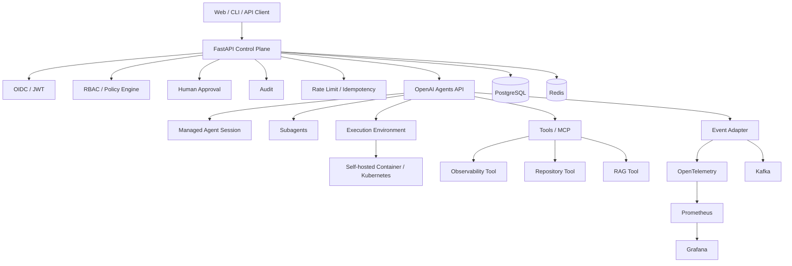

최근 고보상 AI Backend, Platform, Security Architecture 인접 채용공고를 검토하면서 내 약점이 비교적 명확해졌다.

Java/Spring과 Python/FastAPI 기반 백엔드 개발, SQL과 데이터 처리, Linux/Docker, 인증/인가, AI 응용서비스 구현 경험은 있지만 공개적으로 증명할 수 있는 다음 경험은 상대적으로 부족하다.

- Kubernetes 기반 실제 배포와 복구
- Backend Architecture 설계 근거
- Redis/Kafka 등 분산 구성요소를 사용한 문제 해결
- Metrics, Logs, Traces를 연결한 Observability
- 장애 탐지, 원인 분석, 복구, 재발 방지
- 부하 테스트와 병목 개선
- AI Agent를 운영 서비스로 만들 때 필요한 권한, 승인, 감사, 실패 대응

처음에는 이 약점을 보완하기 위해 `AI Backend Production Lab`을 만들려고 했다. 그런데 2026년 9월 10일 OpenAI가 Agents API를 Public Beta로 공개하면서 프로젝트의 중심을 다시 잡을 이유가 생겼다.

OpenAI 공식 발표에 따르면 Agents API는 Codex에 사용되는 agent harness를 관리형 API로 제공하며, OpenAI가 session orchestration, context management, recovery와 agent loop를 운영한다. 개발자는 OpenAI-hosted sandbox, 자체 인프라 또는 지원되는 sandbox provider 중 실행환경을 선택할 수 있다. Durable session, event streaming, 자체 Tool/MCP 연동도 제공된다.

참고:

- [OpenAI - Introducing the Agents API](https://openai.com/index/introducing-the-agents-api/)
- [OpenAI API Reference - Create an agent session](https://developers.openai.com/api/reference/python/resources/beta/subresources/agents/subresources/sessions/methods/create)

이 변화 때문에 내가 직접 agent loop와 context compaction을 다시 만드는 것보다, Agents API 위에 기업 서비스에 필요한 **Security, Policy, Observability, Reliability, Deployment** 계층을 구현하는 것이 더 적절하다고 판단했다.

## 새 프로젝트 목표

새 공개 프로젝트의 가칭은 다음과 같다.

```text
secure-agent-platform-lab
```

프로젝트를 한 문장으로 정의하면 다음과 같다.

> OpenAI Agents API를 기반으로 AI Agent의 인증, 권한, Tool 통제, Human Approval, 감사로그, 관측, 장애 대응과 Kubernetes 배포를 구현하고 검증하는 Production-like 공개 실습 플랫폼

`production-lab` 성격을 명확히 한다. 실제 상용 트래픽 운영 경험으로 포장하지 않고, 운영환경에서 발생할 문제를 재현하고 해결한 공개 증거를 만드는 것이 목적이다.

## 기존 계획에서 무엇을 버리고 무엇을 살릴 것인가

Agents API가 담당할 영역과 내가 직접 구현할 영역을 분리한다.

### 직접 만들지 않을 것

| 기존 아이디어 | 변경 |
|---|---|
| 자체 Agent Loop | Agents API에 위임 |
| 자체 Context Compaction | Agents API에 위임 |
| 자체 Subagent Orchestration | Agents API 기능을 우선 사용 |
| Codex CLI Wrapping | 새 프로젝트에서는 제외 |
| Codex App Server JSONL 제어 | 새 프로젝트에서는 제외 |
| Agent 상태 전체를 자체 DB에 복제 | 최소 메타데이터만 저장 |
| 일반 챗봇 UI | 핵심 범위에서 제외 |
| RAG를 프로젝트의 중심 기능으로 사용 | 필요할 때 Tool로 추가 |

### 계속 직접 구현할 것

| 영역 | 구현 목적 |
|---|---|
| FastAPI | 서비스 API와 Control Plane |
| PostgreSQL | 사용자, 정책, 승인, 감사 메타데이터 |
| Redis | Rate Limit, Idempotency, Lock, 단기 상태 |
| Kafka | Agent Event 비동기 전달과 Consumer 분리 |
| OIDC/JWT | 사용자 인증 |
| RBAC/Policy | Agent와 Tool 접근통제 |
| Human Approval | 위험 작업 통제 |
| Audit Log | 실행 및 정책 판단 기록 |
| OpenTelemetry | Trace와 Context 연결 |
| Prometheus/Grafana | Metrics와 운영 대시보드 |
| k6 | 부하 테스트 및 성능 회귀 검증 |
| Docker/Kubernetes | 재현 가능한 배포와 장애복구 |
| GitHub Actions | Test, Build, Deploy 자동화 |
| Incident Drill | 장애 대응 근거 생성 |

핵심은 Agents API를 호출하는 Wrapper를 만드는 것이 아니다. **Agent가 기업 시스템에 접근할 때 필요한 통제 계층과 운영 계층을 설계하고 검증하는 것**이다.

## 목표 아키텍처



책임을 다음처럼 나눈다.

```text
OpenAI Agents API
= Agent execution state, harness, context, session, tool orchestration

내 플랫폼
= Identity, Authorization, Policy, Approval, Audit,
  Observability, Reliability, Deployment, Incident Response
```

이 경계를 분명히 하는 것 자체가 Architecture 경험의 중요한 근거가 된다.

## 핵심 서비스 시나리오: Incident Investigation Agent

플랫폼만 구현하면 실제 사용 장면이 잘 보이지 않는다. 그래서 기본 Demo는 `Incident Investigation Agent`로 잡는다.

의도적으로 장애를 발생시킬 수 있는 작은 Sample Service를 함께 만든다.

```text
sample-service
  /api/search
  /api/order
  /api/document
```

예를 들어 `/api/search`에서 5xx가 증가했다고 가정한다.

사용자가 다음과 같이 요청한다.

```text
최근 30분 동안 5xx가 증가한 원인을 조사하고 대응안을 정리해줘.
```

Agent는 허용된 Tool 범위 안에서 다음 정보를 조사한다.

```text
Metrics
Logs
Recent deployment
Dependency status
Application configuration
```

필요하면 분석 작업을 Subagent에 분리한다.

```text
Main Agent
  -> Metrics Analysis
  -> Log Analysis
  -> Deployment Analysis
  -> Dependency Analysis
```

중요한 것은 Agent가 장애를 분석하는 것보다 **무엇까지 자동으로 허용할 것인지**다.

예를 들어 정책은 다음처럼 설계한다.

```text
read_metrics    ALLOW
read_logs       ALLOW
read_git_diff   ALLOW
change_code     APPROVAL_REQUIRED
deploy          APPROVAL_REQUIRED
read_secret     DENY
delete_data     DENY
```

이 구조를 통해 Backend, Security Architecture, AI Governance를 한 프로젝트에서 연결한다.

## 두 번째 시나리오: Security Review Agent

두 번째 Demo는 Repository와 Kubernetes 설정을 검토하는 Agent로 확장한다.

대상:

- Dependency
- Dockerfile
- Kubernetes manifest
- Secret 노출 가능성
- 인증/인가 설정
- 과도한 Tool 권한

검토와 보고는 자동화할 수 있지만 코드 변경이나 배포는 승인 이후에만 허용한다.

이 시나리오는 기존 보안 경험을 최근 AI/Backend 개발 경험과 연결하기 위한 것이다.

## 데이터 저장 책임

Agents API가 관리하는 세션 전체 상태를 PostgreSQL에 다시 복제하지 않는다.

내 DB에는 서비스에 필요한 최소 메타데이터만 둔다.

```text
local_session_id
openai_session_id
user_id
workspace_id
agent_profile_id
risk_level
approval_state
status
cost_metadata
created_at
```

즉 다음 원칙을 유지한다.

```text
OpenAI = Agent execution state source
PostgreSQL = Business / Security state source
```

외부 Managed Service와 내부 Business State의 책임을 구분하는 설계 근거를 ADR로 남긴다.

## Event와 Observability

Agents API event를 플랫폼 내부 이벤트로 정규화한다.

예시:

```text
agent.session.started
agent.tool.called
agent.tool.failed
agent.approval.requested
agent.session.completed
```

이벤트는 다음 경로로 전달한다.

```text
Agents API Event
  -> Event Adapter
      -> UI Stream
      -> OpenTelemetry
      -> Metrics
      -> Audit
      -> Kafka
```

Kafka는 Agent를 실행하기 위해 억지로 추가하지 않는다. Audit, Analytics, Notification 같은 Consumer를 실행 흐름과 분리할 필요가 생겼을 때 도입한다.

## 장애 대응 실습

운영 역량을 증명하려면 정상 시나리오만으로는 부족하다. 다음 장애를 의도적으로 재현한다.

| 장애 | 검증할 항목 |
|---|---|
| OpenAI API timeout | timeout, retry, 사용자 상태 처리 |
| OpenAI 5xx | 실패 격리와 복구 |
| MCP/Tool server down | 부분 기능 저하 처리 |
| Tool timeout | Agent task 실패 경계 |
| Redis down | Rate Limit/Lock 영향 |
| PostgreSQL down | Business state 일관성 |
| Kafka consumer down | backlog와 replay |
| Pod crash | Kubernetes 자동 복구 |
| Bad deployment | rollback |
| Event stream disconnect | reconnect와 중복 처리 |
| Unauthorized tool request | DENY 검증 |
| Dangerous operation | Human Approval 검증 |

모든 장애는 실제 운영사고처럼 포장하지 않고 `Incident Drill`로 기록한다.

각 기록은 다음 형식을 따른다.

```text
상황
-> 탐지
-> 영향 범위
-> 원인 분석
-> 완화
-> 복구
-> 재발 방지
-> 검증 결과
```

## 성능 테스트 기준

일반 REST API의 RPS만 측정하지 않는다. Agent Platform에 맞는 지표를 함께 본다.

```text
API P95 / P99
Session creation latency
Event delivery latency
Concurrent sessions
Tool-call latency
Tool failure rate
Agent completion rate
Approval wait time
Error rate
Token usage
Cost per task
```

k6로 부하를 단계적으로 증가시키고, CPU/Memory/DB connection/Redis/Kafka/Agent latency를 함께 관찰한다.

목표는 높은 숫자를 만드는 것이 아니라 병목을 발견하고 **변경 전과 변경 후를 근거로 남기는 것**이다.

## Kubernetes에서 직접 검증할 내용

CKA 학습과 별개로 프로젝트에서 직접 다음 항목을 사용하고 이유를 설명할 수 있어야 한다.

- Deployment
- Service
- Ingress
- ConfigMap
- Secret
- PersistentVolumeClaim
- Readiness/Liveness Probe
- Resource Request/Limit
- Rolling Update/Rollback
- HPA
- Namespace
- RBAC
- NetworkPolicy

`Kubernetes를 사용했다`에서 끝내지 않고, 각 기능이 실제 장애와 운영 요구사항에서 어떤 역할을 했는지 기록한다.

## 단계별 구현 로드맵

한 번에 모든 기술을 넣지 않는다. 각 단계가 독립적으로 검증 가능한 상태에서 다음 단계로 이동한다.

### Phase 0. 공개 저장소와 기준선 만들기

할 일:

- Public repository `secure-agent-platform-lab` 생성
- README에 프로젝트 목적과 `production-like lab`임을 명시
- LICENSE 선택
- AGENTS.md와 개발 원칙 작성
- `.env.example` 제공, Secret commit 방지
- Python/FastAPI 기본 프로젝트 구성
- pytest, lint, type check 구성
- GitHub Actions에서 기본 CI 통과

완료 조건:

```text
clone -> test -> run 과정이 README만 보고 재현 가능
```

### Phase 1. Agents API 최소 Vertical Slice

할 일:

- FastAPI에서 Agents API adapter 구현
- Agent Session 생성
- 사용자 입력 전달
- Event streaming 처리
- Session ID 매핑
- 실패/timeout 기본 처리
- API mock을 이용한 단위 테스트

완료 조건:

```text
Client -> FastAPI -> Agents API -> streamed result
```

이 경로가 반복 실행 가능하고 테스트된다.

### Phase 2. Identity, RBAC, Policy

할 일:

- JWT 또는 OIDC 인증
- User / Role / Workspace 모델
- Agent Profile 권한
- Tool별 ALLOW / DENY / APPROVAL_REQUIRED 정책
- 감사 이벤트 저장
- 권한 실패 테스트

완료 조건:

허용되지 않은 Tool 호출이 실제 실행 전에 차단된다.

### Phase 3. Observability

할 일:

- OpenTelemetry 적용
- Request/Agent/Tool trace 연결
- Prometheus metrics
- Grafana dashboard
- Error rate, latency, tool failure 지표
- correlation ID 설계

완료 조건:

하나의 사용자 요청을 API -> Agent -> Tool까지 추적할 수 있다.

### Phase 4. Incident Investigation Agent

할 일:

- Sample Service 구현
- Metrics 조회 Tool
- Log 조회 Tool
- Deployment 정보 Tool
- Incident Agent Profile
- 읽기 작업과 변경 작업의 권한 분리

완료 조건:

의도적으로 만든 5xx 장애의 원인을 Agent가 허용된 읽기 Tool만 사용해 조사하고 근거와 함께 정리한다.

### Phase 5. Redis와 Reliability Pattern

할 일:

- Rate Limiting
- Idempotency Key
- Distributed Lock이 필요한 구간 식별
- Timeout/Retry 정책
- 중복 Event 처리 방지
- Redis 장애 테스트

완료 조건:

중복 요청과 부분 장애에서도 상태가 예측 가능한 규칙을 따른다.

### Phase 6. Load Test와 병목 개선

할 일:

- k6 테스트 시나리오
- Baseline 측정
- P95/P99와 error rate 기록
- 병목 한 가지 이상 식별
- 개선 적용
- 개선 전후 보고서 작성

완료 조건:

`LOAD_TEST_REPORT.md`에 재현 가능한 조건과 실제 측정 결과가 남는다.

### Phase 7. Kubernetes 배포

할 일:

- Deployment/Service/Ingress
- ConfigMap/Secret
- Probe
- Resource Request/Limit
- RBAC/Namespace
- NetworkPolicy
- Rolling Update와 Rollback
- 필요 시 HPA

완료 조건:

배포, 업데이트, 실패한 배포의 rollback을 명령과 증거로 재현할 수 있다.

### Phase 8. Incident Drill

할 일:

- OpenAI timeout/5xx
- Tool server down
- DB/Redis 장애
- Pod crash
- Bad deployment
- Event stream disconnect
- Unauthorized Tool request

각 시나리오에 Incident Report 작성.

완료 조건:

최소 5개 이상의 독립 장애 시나리오가 탐지 -> 분석 -> 복구 -> 검증까지 재현된다.

### Phase 9. Kafka Event Pipeline

할 일:

- 내부 Agent Event schema 정의
- Kafka producer
- Audit/Analytics consumer 분리
- consumer 중단 및 replay 검증
- backlog monitoring

Kafka가 실제 문제를 해결하지 못한다면 이 단계는 생략하거나 뒤로 미룬다.

### Phase 10. Security Review Agent

할 일:

- Repository read-only Tool
- Dependency/Docker/Kubernetes 설정 검토
- 위험 결과 Report
- Code change는 승인 대상으로 제한
- Secret 접근은 명시적으로 차단

완료 조건:

Security Review Agent가 검사와 수정 권한을 분리하고 정책 위반을 우회하지 못한다.

### Phase 11. Self-hosted Execution Environment

할 일:

- 격리된 Container/Kubernetes 실행환경
- workspace allowlist
- non-root execution
- resource limit
- network egress 통제 검토
- Secret 전달 경계 검토

완료 조건:

Agent가 host 전체 권한 없이 제한된 환경에서만 Tool과 파일을 사용한다.

### Phase 12. 최종 포트폴리오 정리

최종 산출물:

```text
README.md
ARCHITECTURE.md
SECURITY.md
DEPLOYMENT.md
OBSERVABILITY.md
LOAD_TEST_REPORT.md
RUNBOOK.md
INCIDENT_REPORTS/
ADR/
```

각 문서는 코드와 테스트 결과에 연결되어야 한다.

## 당장 다음에 할 일

현재 가장 먼저 할 일은 기술을 더 공부하는 것이 아니라 **작은 Vertical Slice를 실행 가능한 공개 저장소로 만드는 것**이다.

순서는 다음과 같이 잡는다.

```text
1. secure-agent-platform-lab 공개 저장소 생성
2. FastAPI + pytest + CI 기본 골격
3. OpenAI Agents API Session 생성/streaming 최소 구현
4. PostgreSQL에 Local/OpenAI Session ID 매핑
5. 첫 번째 ADR 작성
6. JWT/RBAC/Tool Policy 추가
7. OpenTelemetry로 Request-Agent-Tool trace 연결
8. Sample Service와 Incident Investigation Agent 구현
9. 그 이후 Redis, 성능 테스트, Kubernetes 순으로 확장
```

Phase 0~4까지만 완료해도 프로젝트의 목적은 충분히 설명할 수 있다. Redis, Kafka, Kubernetes 같은 기술은 필요성이 생겼을 때 추가해도 늦지 않다.

## 기존 Codex Remote Gateway와의 관계

기존 `codex-remote-gateway`는 버리지 않는다.

그 프로젝트는 self-hosted Linux 서버에서 Codex runtime을 직접 제어하고 browser control surface를 만드는 별도의 문제를 해결한다. 새 프로젝트에서는 같은 기능을 다시 만드는 대신 Managed Agents API 위에 Security/Observability/Deployment 계층을 설계한다.

따라서 두 프로젝트는 다음처럼 구분한다.

```text
codex-remote-gateway
= Codex runtime 직접 통합과 self-hosted control 경험

secure-agent-platform-lab
= Managed Agent Harness를 활용한
  Production AI Platform Architecture 경험
```

두 프로젝트를 함께 보면 단순히 특정 API를 사용한 경험이 아니라, 직접 runtime을 통합하는 방식과 managed harness를 사용하는 방식의 경계와 trade-off를 비교할 수 있다.

## 이 프로젝트로 만들고 싶은 증거

최종 목표는 기술 이름을 이력서에 추가하는 것이 아니다.

이 프로젝트가 끝났을 때 다음 질문에 코드와 문서로 답할 수 있어야 한다.

- Agent가 위험한 Tool을 실행하지 못하도록 어떻게 통제했는가?
- 장시간 Agent 실행이 실패했을 때 어떻게 관측하고 복구하는가?
- Managed Agent 상태와 내부 Business State의 책임을 어떻게 나눴는가?
- 장애가 발생했을 때 어떤 지표와 Trace로 원인을 찾았는가?
- 부하가 증가했을 때 병목은 어디였고 어떻게 개선했는가?
- Kubernetes에서 배포 실패와 Pod 장애를 어떻게 처리했는가?
- 어떤 작업은 자동화하고 어떤 작업은 Human Approval에 남겼는가?

이 질문에 실제 Git commit, 테스트, Dashboard, Load Test Report, Incident Report, ADR로 답할 수 있다면 현재 약점인 **Cloud/Kubernetes, Architecture, Production AI, Observability, Security Architecture**를 하나의 공개 프로젝트에서 상당 부분 보완할 수 있다.
